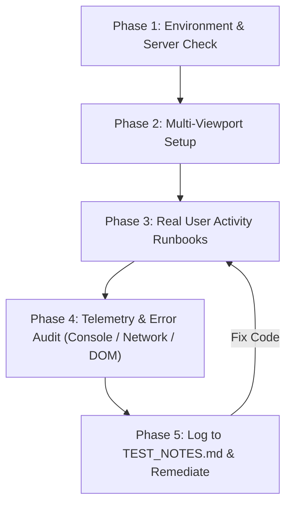

# Live Interactive Testing with Playwright MCP

This skill provides a rigorous, real-world testing runbook for the **ANCHOR** application. It leverages the **Playwright MCP** server (`call_mcp_tool` with `ServerName: "playwright"`) to simulate authentic user workflows, observe dynamic UI states, detect layout or runtime errors, log structured findings into a dedicated test ledger, and verify subsequent code fixes.

---

## Tool Reference: Playwright MCP Tools

All browser interactions must be executed via `call_mcp_tool` targeting `ServerName: "playwright"`. Key tools include:

| Tool Name | Key Arguments | Purpose |
| :--- | :--- | :--- |
| `browser_navigate` | `{"url": "http://localhost:3000/..."}` | Navigates the active session to any application route. |
| `browser_snapshot` | `{"boxes": true}` | Captures an accessibility DOM snapshot with element bounding boxes. Preferred over screenshots for structural analysis. |
| `browser_take_screenshot` | `{"filename": "..."}` | Captures visual render state for visual bug verification. |
| `browser_resize` | `{"width": 375, "height": 812}` | Resizes the viewport to test responsive layouts (Mobile, Tablet, Desktop). |
| `browser_click` | `{"target": "selector or ref"}` | Performs a real user click event on buttons, tabs, links, or checkboxes. |
| `browser_fill_form` | `{"fields": [...]}` | Populates forms, dialog fields, and modals. |
| `browser_type` | `{"text": "..."}` | Types text into focused inputs or search bars. |
| `browser_press_key` | `{"key": "Enter" \| "Escape"}` | Sends keyboard shortcuts (e.g. `⌘K`, `Escape` to close modals). |
| `browser_console_messages`| `{}` | Retrieves recent console logs, warnings, and uncaught exceptions. |
| `browser_network_requests`| `{}` | Inspects recent client-side HTTP requests and status codes. |
| `browser_wait_for` | `{"text": "...", "timeout": 5000}` | Waits for UI transitions, toast notifications, or dynamic components. |
| `browser_evaluate` | `{"expression": "..."}` | Evaluates JavaScript in the browser context (e.g., checking element dimensions). |
| `browser_close` | `{}` | Closes browser tabs and sessions upon test completion. |

---

## Standard Viewport Profiles

Always test the application across these standard viewport breakpoints:

1. **Mobile Portrait (iPhone / Android)**:
   - Width: `375` (or `390`), Height: `812`
   - Focus: Touch targets, bottom navigation bar (`MobileBottomNav`), floating action button (FAB), collapsible drawers (`MobileNavDrawer`), absence of horizontal viewport blowout (`document.body.scrollWidth === window.innerWidth`).
2. **Tablet (iPad / Foldable)**:
   - Width: `768`, Height: `1024`
   - Focus: Asymmetric grid collapsibility, sub-bar wrapping, navigation transition from bottom bar to header drawer.
3. **Desktop (Full Canvas)**:
   - Width: `1440` (or `1720`), Height: `900`
   - Focus: Persistent sidebar (`DesktopSidebar`), 7-column calendar matrix, multi-column analytics grids, search shortcut rails (`⌘K`).

---

## The 5-Phase Live Testing Workflow



### Phase 1: Environment & Server Verification
1. Ensure the local application server is active.
   - For dev mode: `npm run dev` (running at `http://localhost:3000`).
   - For production mode: `npm run build && npm run start`.
2. Initial health check:
   - Navigate to `http://localhost:3000` via `browser_navigate`.
   - Inspect console logs with `browser_console_messages`.

### Phase 2: Multi-Viewport Configuration
Set the viewport dimensions before executing a test suite:
```json
{
  "ServerName": "playwright",
  "ToolName": "browser_resize",
  "Arguments": {
    "width": 375,
    "height": 812
  }
}
```

### Phase 3: Route-by-Route Activity Runbooks

Execute the following authentic user activities per screen:

#### 1. Executive Overview (`/`)
* **Actions**:
  1. Navigate to `/`.
  2. Click timeframe filter pills (`Today`, `Week`, `Month`, `Quarter`).
  3. Click a task checkbox in `DailyFocusCard` to resolve/reopen it; observe toast notification.
  4. Toggle expense categories in `OutflowDonutChart`.
  5. Click the `+` FAB or `+ Quick Entry` button to open `QuickEntryModal`.
  6. Fill in an outflow amount, category, and payee; click **Commit to Ledger**.
* **Verification**:
  - Verify that the debit appears in `TodayDebitsCard` immediately.
  - Verify that total net liquidity and debit sums update dynamically.

#### 2. Calendar & Sovereign Goals Nexus (`/calendar`)
* **Actions**:
  1. Navigate to `/calendar`.
  2. Verify Friday, Sep 11, 2026 is highlighted with the black anchor indicator badge.
  3. Click a different day in the 35-cell matrix (e.g. `2026-09-04` or `2026-09-18`).
  4. Observe `DayNexusInspector` re-anchoring to the clicked date.
  5. In `DayNexusInspector`, click an active task checkbox. Verify the task toggles and the matrix day pill updates instantly.
  6. Click `Week` view, then `Day` view in the header toggle; verify matrix adapts to 7-column or 1-column layout without overflow.
  7. Click `<` (Previous Month) and `>` (Next Month); verify smooth month transition without hook order errors.
  8. Click `Today` button to re-focus September 11.
  9. Click `+ New Entry / Event`; submit a test event and confirm matrix reflection.

#### 3. The Ledger & Cashflow Stream (`/finance`)
* **Actions**:
  1. Navigate to `/finance`.
  2. Click the month selector dropdown and switch billing cycles.
  3. Click account cards in `AccountsRibbon` to filter by checking, savings, or credit.
  4. Toggle the flow type filter (`Inflow (+)`, `Outflow (-)`, `Transfers`).
  5. Type into the `Filter records...` search box and verify immediate ledger filtering.
  6. In `QuickEntryDock`, enter a new transaction and submit; verify new row in the stream.
  7. Click `Export CSV` and verify clean generation.

#### 4. Temporal Focus & Projects (`/tasks`)
* **Actions**:
  1. Navigate to `/tasks`.
  2. Switch tabs (`Today`, `Upcoming`, `Completed`).
  3. Toggle completion state of tasks in `ExecutionPipeline`.
  4. Click `+ New Task` / FAB; enter title, priority, due date, and submit.
  5. On mobile, verify bottom navigation and quick capture flow.

#### 5. Reflective Sanctuary & Journal (`/notes`)
* **Actions**:
  1. Navigate to `/notes`.
  2. Click horizontal timeline date pills (e.g. `Sep 10`, `Sep 09`).
  3. Edit the daily inquiry answer text and save.
  4. Click `Continue Writing` to launch the reflection dialog.
  5. Search journal archives with keyword filter.

---

### Phase 4: Telemetry & Automated Error Audit

After completing each user journey or navigation event, execute an automated audit:

1. **Console Error Inspection**:
   ```json
   {
     "ServerName": "playwright",
     "ToolName": "browser_console_messages",
     "Arguments": {}
   }
   ```
   - Check for: React warnings, hydration errors, "Rules of Hooks" order violations, unhandled Promise rejections, missing key props, 404 image/font loads.
2. **Network Request Check**:
   ```json
   {
     "ServerName": "playwright",
     "ToolName": "browser_network_requests",
     "Arguments": {}
   }
   ```
   - Check for: HTTP 4xx/5xx status codes, failed API syncs, or hanging requests.
3. **Viewport Overflow & Accessibility Audit**:
   ```json
   {
     "ServerName": "playwright",
     "ToolName": "browser_evaluate",
     "Arguments": {
       "expression": "({ scrollWidth: document.documentElement.scrollWidth, innerWidth: window.innerWidth, hasHorizontalOverflow: document.documentElement.scrollWidth > window.innerWidth })"
     }
   }
   ```
   - If `hasHorizontalOverflow` is `true`, inspect bounding boxes to locate the offending element blowing out the layout.

---

### Phase 5: Findings Ledger (`TEST_NOTES.md`) & Remediation

When any bug, visual defect, or console warning is discovered, record it in `docs/TEST_NOTES.md` (or workspace root `TEST_NOTES.md`) using the standard finding schema:

#### Standard Finding Record Format:
```markdown
### [ISSUE-<ID>] <Short Title>
- **Severity**: CRITICAL | HIGH | MEDIUM | LOW
- **Route**: e.g., `/calendar`
- **Viewport**: Mobile (375x812) | Tablet (768x1024) | Desktop (1440x900)
- **Status**: OPEN | IN_PROGRESS | RESOLVED
- **Steps to Reproduce**:
  1. Navigate to `/calendar`.
  2. Click 'Today' button while in 'Day' view.
- **Observed Behavior**: Console logs "React has detected a change in the order of Hooks".
- **Expected Behavior**: Deterministic hook execution and view state update.
- **Evidence / Logs**:
  ```text
  React Hook useMemo is called conditionally...
  ```
- **Root Cause**: Component returned early on loading before hook execution.
- **Fix & Verification**:
  - Code changes made in `src/app/calendar/page.tsx`.
  - Verified with Playwright MCP: re-clicked 'Today' button, zero console errors returned.
```

#### Remediation Protocol:
1. Identify the source file and root cause.
2. Apply the surgical fix using code editing tools (`replace_file_content` or `write_to_file`).
3. Re-run `npm run build` and TypeScript checks (`npx tsc --noEmit`).
4. Re-engage Playwright MCP to reproduce the exact user journey. Verify the issue is resolved and no regressions occurred.
5. Mark the issue status as `RESOLVED` in `TEST_NOTES.md`.
