# ANCHOR Life Command Center — Database Schema Specification

This document provides a comprehensive, human-readable reference for the ANCHOR database architecture, entity relationships, security policies, and migration workflows.

---

## 1. Architectural Architecture & Identity Model

* **Database Engine:** PostgreSQL 15+ hosted on [Supabase](https://supabase.com).
* **Identity Provider:** [Clerk Authentication](https://clerk.com).
* **Identity Mapping:** 
  The primary user identity key is Clerk's string identifier (e.g. `user_2tX...`). All user-owned tables reference `public.profiles(id)` via `user_id TEXT REFERENCES public.profiles(id) ON DELETE CASCADE`.
* **Row-Level Security (RLS):**
  RLS is strictly enabled on **100% of tables**. Access is resolved through `public.requesting_user_id()`, which extracts the user ID from either Clerk's JWT claims (`request.jwt.claims ->> 'sub'`) or native Supabase `auth.uid()`.
* **Timestamp Handling:** All timestamps are timezone-aware UTC (`TIMESTAMPTZ`), and all mutable entities feature automated triggers refreshing `updated_at`.

---

## 2. Entity-Relationship Diagram (ERD)

```mermaid
erDiagram
    PROFILES ||--o{ ACCOUNTS : "owns"
    PROFILES ||--o{ TRANSACTIONS : "records"
    PROFILES ||--o{ BUDGET_ENVELOPES : "allocates"
    PROFILES ||--o{ RECURRING_OBLIGATIONS : "subscribes"
    PROFILES ||--o{ PROJECTS : "leads"
    PROFILES ||--o{ TASKS : "executes"
    PROFILES ||--o{ JOURNAL_ENTRIES : "writes"
    PROFILES ||--o{ PINNED_MAXIMS : "affixes"
    PROFILES ||--o{ CALENDAR_EVENTS : "schedules"
    PROFILES ||--o{ SOVEREIGN_GOALS : "tracks"

    ACCOUNTS ||--o{ TRANSACTIONS : "holds"
    ACCOUNTS ||--o{ TRANSACTIONS : "destination for transfer"
    PROJECTS ||--o{ TASKS : "organizes"
    PROJECTS ||--o{ JOURNAL_ENTRIES : "referenced in"

    PROFILES {
        text id PK "Clerk User ID"
        text email "Unique email"
        text full_name "Full name"
        text avatar_url "Profile photo"
        timestamptz created_at
        timestamptz updated_at
    }

    ACCOUNTS {
        uuid id PK
        text user_id FK
        text name "Account label"
        text type "checking, cash, savings, credit"
        text institution "Bank / Broker"
        text account_number_masked "Masked number"
        numeric balance "Available balance"
        text currency "INR, USD, EUR, GBP"
        text status "active, reconciled, archived"
        numeric credit_limit
        date payment_due_date
        timestamptz last_reconciled_at
    }

    TRANSACTIONS {
        uuid id PK
        text user_id FK
        uuid account_id FK
        uuid destination_account_id FK
        numeric amount "Signed amount"
        text currency
        text flow_type "inflow, outflow, transfer"
        text category "Domain category"
        text payee_or_payer
        text note
        date date
        time time
        text payment_method "cash, upi, card, direct_deposit, wire"
        text status "cleared, pending, reconciled"
        boolean is_recurring
    }

    BUDGET_ENVELOPES {
        uuid id PK
        text user_id FK
        text category "Category"
        text label
        numeric allocated_amount
        text currency
        text cycle "e.g. 2026-09"
        text icon
    }

    RECURRING_OBLIGATIONS {
        uuid id PK
        text user_id FK
        text name
        numeric amount
        text currency
        text billing_cycle "monthly, quarterly, annual"
        text renewal_notice
        text status "upcoming, cleared, alert"
        text category
        date due_date
    }

    PROJECTS {
        uuid id PK
        text user_id FK
        text title
        text tag
        text description
        integer progress_percentage
        text next_milestone
        date target_date
        text accent_color
        text status "active, completed, archived"
    }

    TASKS {
        uuid id PK
        text user_id FK
        uuid project_id FK
        text title
        text priority "low, medium, high"
        text category "work, personal, finance, learning"
        text tab_category "today, upcoming, overdue, completed, backlog"
        text status_badge
        date due_date
        time due_time
        text due_info
        integer estimated_minutes
        boolean is_focus_block
        boolean is_completed
        timestamptz completed_at
    }

    JOURNAL_ENTRIES {
        uuid id PK
        text user_id FK
        date date_key "Unique per user day"
        integer entry_number
        text title
        text snippet
        integer word_count
        integer reading_time_minutes
        text mood_tag "Grounded, Strategic, Review, Systems, Weekly Audit"
        text inquiry_question
        boolean inquiry_answered
        text inquiry_answer
        text tone_assessment
        jsonb content_paragraphs
        text quote
        text quote_attribution
        jsonb observations
        jsonb micro_observations
        uuid linked_project_id FK
        text_array tags
        boolean is_pinned
    }

    PINNED_MAXIMS {
        uuid id PK
        text user_id FK
        text quote
        text attribution
        text source_codex
        boolean is_active
    }

    CALENDAR_EVENTS {
        uuid id PK
        text user_id FK
        text title
        date date
        time time
        text type "event, task, financial, journal"
        numeric amount
        text note
        boolean is_reconciled
    }

    SOVEREIGN_GOALS {
        uuid id PK
        text user_id FK
        text title
        text subtitle
        text target_horizon
        integer progress_percentage
        text achieved_metric
        text gap_metric
        text meter_color
        date target_date
    }
```



---

## 3. Data Tables & Column Details

### 3.1 `profiles`
Identity table holding user profile metadata anchored to Clerk authentication.

| Column | Type | Nullable | Default | Description |
| :--- | :--- | :--- | :--- | :--- |
| `id` | `TEXT` | No | *(None)* | **Primary Key**. Clerk User ID (e.g., `user_2tX...`). |
| `email` | `TEXT` | Yes | `NULL` | User's primary email address (Unique). |
| `full_name` | `TEXT` | Yes | `NULL` | Full display name. |
| `avatar_url` | `TEXT` | Yes | `NULL` | Profile picture URL. |
| `created_at` | `TIMESTAMPTZ` | No | `now()` | Registration timestamp. |
| `updated_at` | `TIMESTAMPTZ` | No | `now()` | Auto-updated on record changes. |

---

### 3.2 `accounts`
Depository and liability financial accounts (Checking, Cash, Savings, Credit).

| Column | Type | Nullable | Default | Description |
| :--- | :--- | :--- | :--- | :--- |
| `id` | `UUID` | No | `gen_random_uuid()` | **Primary Key**. |
| `user_id` | `TEXT` | No | *(None)* | Foreign key to `profiles.id` (Cascade). |
| `name` | `TEXT` | No | *(None)* | Human-friendly name (e.g., "HDFC Operational Checking"). |
| `type` | `TEXT` | No | *(None)* | Account type: `checking`, `cash`, `savings`, `credit`. |
| `institution` | `TEXT` | Yes | `NULL` | Bank or financial institution name. |
| `account_number_masked` | `TEXT` | Yes | `NULL` | Masked identifier (e.g., `•••• 4892`). |
| `balance` | `NUMERIC(14,2)`| No | `0.00` | Current balance. |
| `currency` | `TEXT` | No | `'INR'` | Currency code: `INR`, `USD`, `EUR`, `GBP`. |
| `status` | `TEXT` | No | `'active'` | Account state: `active`, `reconciled`, `archived`. |
| `trend_label` | `TEXT` | Yes | `NULL` | MoM percentage label (e.g., `+12.4% MoM`). |
| `credit_limit` | `NUMERIC(14,2)`| Yes | `NULL` | Credit limit for credit accounts. |
| `payment_due_date`| `DATE` | Yes | `NULL` | Monthly payment due date for credit cards. |
| `last_reconciled_at`| `TIMESTAMPTZ`| Yes | `now()` | Last balance reconciliation timestamp. |
| `created_at` | `TIMESTAMPTZ` | No | `now()` | Creation timestamp. |
| `updated_at` | `TIMESTAMPTZ` | No | `now()` | Auto-updated on record changes. |

---

### 3.3 `transactions`
The double-entry capable transaction ledger tracking inflows, outflows, and transfers.

| Column | Type | Nullable | Default | Description |
| :--- | :--- | :--- | :--- | :--- |
| `id` | `UUID` | No | `gen_random_uuid()` | **Primary Key**. |
| `user_id` | `TEXT` | No | *(None)* | Foreign key to `profiles.id` (Cascade). |
| `account_id` | `UUID` | No | *(None)* | Source account foreign key to `accounts.id`. |
| `destination_account_id`| `UUID` | Yes | `NULL` | Target account for inter-account transfers. |
| `amount` | `NUMERIC(14,2)`| No | *(None)* | Inflows positive, outflows negative. |
| `currency` | `TEXT` | No | `'INR'` | Currency code: `INR`, `USD`, `EUR`, `GBP`. |
| `flow_type` | `TEXT` | No | *(None)* | Direction: `inflow`, `outflow`, `transfer`. |
| `category` | `TEXT` | No | *(None)* | Canonical category (e.g. `food_dining`, `salary_payroll`). |
| `payee_or_payer` | `TEXT` | No | *(None)* | Counterparty name. |
| `note` | `TEXT` | Yes | `NULL` | Optional memo / ledger note. |
| `date` | `DATE` | No | `CURRENT_DATE` | Transaction date (YYYY-MM-DD). |
| `time` | `TIME` | Yes | `CURRENT_TIME` | Transaction time (HH:MM). |
| `payment_method` | `TEXT` | No | `'card'` | Instrument: `cash`, `upi`, `card`, `direct_deposit`, `wire`. |
| `status` | `TEXT` | No | `'cleared'` | Clearing status: `cleared`, `pending`, `reconciled`. |
| `is_recurring` | `BOOLEAN` | No | `false` | Flag indicating recurring subscription/bill. |
| `created_at` | `TIMESTAMPTZ` | No | `now()` | Record creation timestamp. |
| `updated_at` | `TIMESTAMPTZ` | No | `now()` | Auto-updated on record changes. |

---

### 3.4 `budget_envelopes`
Monthly budget allocation envelopes for disciplined burn-rate containment.

| Column | Type | Nullable | Default | Description |
| :--- | :--- | :--- | :--- | :--- |
| `id` | `UUID` | No | `gen_random_uuid()` | **Primary Key**. |
| `user_id` | `TEXT` | No | *(None)* | Foreign key to `profiles.id` (Cascade). |
| `category` | `TEXT` | No | *(None)* | Envelope category. |
| `label` | `TEXT` | No | *(None)* | Display label (e.g. "Housing & Utilities"). |
| `allocated_amount`| `NUMERIC(14,2)`| No | `0.00` | Budget cap allocated for the cycle. |
| `currency` | `TEXT` | No | `'INR'` | Currency code. |
| `cycle` | `TEXT` | No | *(None)* | Billing cycle key (e.g., `'2026-09'`). |
| `icon` | `TEXT` | Yes | `NULL` | Icon identifier or token. |
| `created_at` | `TIMESTAMPTZ` | No | `now()` | Creation timestamp. |
| `updated_at` | `TIMESTAMPTZ` | No | `now()` | Auto-updated on record changes. |

* **Constraint:** Unique index on `(user_id, category, cycle)`.

---

### 3.5 `recurring_obligations`
Fixed liabilities, software subscriptions, insurance, and recurring payroll.

| Column | Type | Nullable | Default | Description |
| :--- | :--- | :--- | :--- | :--- |
| `id` | `UUID` | No | `gen_random_uuid()` | **Primary Key**. |
| `user_id` | `TEXT` | No | *(None)* | Foreign key to `profiles.id` (Cascade). |
| `name` | `TEXT` | No | *(None)* | Subscription / obligation title. |
| `amount` | `NUMERIC(14,2)`| No | *(None)* | Amount billed per cycle. |
| `currency` | `TEXT` | No | `'INR'` | Currency code. |
| `billing_cycle` | `TEXT` | No | *(None)* | `monthly`, `quarterly`, `annual`. |
| `renewal_notice` | `TEXT` | Yes | `NULL` | Notice lead time (e.g., "7 days before renewal"). |
| `status` | `TEXT` | No | `'upcoming'` | Status: `upcoming`, `cleared`, `alert`. |
| `category` | `TEXT` | No | *(None)* | Expense classification. |
| `icon` | `TEXT` | Yes | `NULL` | Brand / icon token. |
| `due_date` | `DATE` | Yes | `NULL` | Next scheduled renewal date. |
| `created_at` | `TIMESTAMPTZ` | No | `now()` | Record creation timestamp. |
| `updated_at` | `TIMESTAMPTZ` | No | `now()` | Auto-updated on record changes. |

---

### 3.6 `projects`
High-level strategic initiatives and project tracks.

| Column | Type | Nullable | Default | Description |
| :--- | :--- | :--- | :--- | :--- |
| `id` | `UUID` | No | `gen_random_uuid()` | **Primary Key**. |
| `user_id` | `TEXT` | No | *(None)* | Foreign key to `profiles.id` (Cascade). |
| `title` | `TEXT` | No | *(None)* | Initiative title (e.g. "ANCHOR Core System"). |
| `tag` | `TEXT` | Yes | `NULL` | Domain tag (e.g. "CORE SYSTEM"). |
| `description` | `TEXT` | Yes | `NULL` | Executive summary or mission statement. |
| `progress_percentage`| `INTEGER` | No | `0` | Completion percentage (0 to 100). |
| `next_milestone` | `TEXT` | Yes | `NULL` | Immediate next milestone description. |
| `target_date` | `DATE` | Yes | `NULL` | Target deadline. |
| `accent_color` | `TEXT` | Yes | `NULL` | Hex color code for UI accents. |
| `status` | `TEXT` | No | `'active'` | Status: `active`, `completed`, `archived`. |
| `created_at` | `TIMESTAMPTZ` | No | `now()` | Creation timestamp. |
| `updated_at` | `TIMESTAMPTZ` | No | `now()` | Auto-updated on record changes. |

---

### 3.7 `tasks`
Atomic operational tasks and focus blocks with priority and due dates.

| Column | Type | Nullable | Default | Description |
| :--- | :--- | :--- | :--- | :--- |
| `id` | `UUID` | No | `gen_random_uuid()` | **Primary Key**. |
| `user_id` | `TEXT` | No | *(None)* | Foreign key to `profiles.id` (Cascade). |
| `project_id` | `UUID` | Yes | `NULL` | Foreign key to `projects.id` (Set Null). |
| `title` | `TEXT` | No | *(None)* | Task description. |
| `priority` | `TEXT` | No | `'medium'` | Priority level: `low`, `medium`, `high`. |
| `category` | `TEXT` | No | `'work'` | Domain: `work`, `personal`, `finance`, `learning`. |
| `tab_category` | `TEXT` | No | `'today'` | Tab: `today`, `upcoming`, `overdue`, `completed`, `backlog`. |
| `status_badge` | `TEXT` | Yes | `NULL` | UI pill badge text (e.g. "IN EXECUTION"). |
| `due_date` | `DATE` | Yes | `NULL` | Due date. |
| `due_time` | `TIME` | Yes | `NULL` | Due time (e.g., 18:00). |
| `due_info` | `TEXT` | Yes | `NULL` | Formatted label (e.g. "Due 6:00 PM"). |
| `estimated_minutes`| `INTEGER` | Yes | `30` | Time estimate in minutes. |
| `is_focus_block` | `BOOLEAN` | No | `false` | Denotes dedicated deep-work focus block. |
| `is_completed` | `BOOLEAN` | No | `false` | Completion status boolean. |
| `completed_at` | `TIMESTAMPTZ` | Yes | `NULL` | Timestamp when checked off. |
| `created_at` | `TIMESTAMPTZ` | No | `now()` | Creation timestamp. |
| `updated_at` | `TIMESTAMPTZ` | No | `now()` | Auto-updated on record changes. |

---

### 3.8 `journal_entries`
Daily reflective entries, evening inquiry assessments, and micro-observations.

| Column | Type | Nullable | Default | Description |
| :--- | :--- | :--- | :--- | :--- |
| `id` | `UUID` | No | `gen_random_uuid()` | **Primary Key**. |
| `user_id` | `TEXT` | No | *(None)* | Foreign key to `profiles.id` (Cascade). |
| `date_key` | `DATE` | No | *(None)* | Entry date (Unique per user). |
| `entry_number` | `INTEGER` | Yes | `NULL` | Sequential entry counter (e.g. #254). |
| `title` | `TEXT` | No | *(None)* | Journal entry headline. |
| `snippet` | `TEXT` | Yes | `NULL` | One-sentence summary. |
| `word_count` | `INTEGER` | No | `0` | Calculated word count. |
| `reading_time_minutes`| `INTEGER`| No | `1` | Estimated reading duration in minutes. |
| `mood_tag` | `TEXT` | No | `'Grounded'`| Mood: `Grounded`, `Strategic`, `Review`, `Systems`, `Weekly Audit`. |
| `inquiry_question`| `TEXT` | Yes | `NULL` | Daily prompt question. |
| `inquiry_answered`| `BOOLEAN` | No | `false` | Whether prompt was answered. |
| `inquiry_answer` | `TEXT` | Yes | `NULL` | User's response text to prompt. |
| `tone_assessment`| `TEXT` | Yes | `NULL` | Algorithmic / self-assessed tone note. |
| `content_paragraphs`| `JSONB` | No | `'[]'::jsonb`| Array of narrative markdown paragraphs. |
| `quote` | `TEXT` | Yes | `NULL` | Stoic anchor quotation. |
| `quote_attribution`| `TEXT` | Yes | `NULL` | Quotation author or source codex. |
| `observations` | `JSONB` | No | `'[]'::jsonb`| Array of `{ title, note }` entries. |
| `micro_observations`| `JSONB`| No | `'{"time":"","items":[]}'`| Structured micro notes logged throughout day. |
| `linked_project_id`| `UUID` | Yes | `NULL` | Foreign key to `projects.id`. |
| `logged_time_info`| `TEXT` | Yes | `NULL` | Meta string (e.g. "Logged at 21:40 EST"). |
| `tags` | `TEXT[]` | No | `'{}'` | Array of taxonomy hashtags. |
| `is_pinned` | `BOOLEAN` | No | `false` | Highlighted / pinned flag. |
| `created_at` | `TIMESTAMPTZ` | No | `now()` | Creation timestamp. |
| `updated_at` | `TIMESTAMPTZ` | No | `now()` | Auto-updated on record changes. |

* **Constraint:** Unique index on `(user_id, date_key)`.

---

### 3.9 `pinned_maxims`
Core guiding principles and codex axioms affixed to reviews.

| Column | Type | Nullable | Default | Description |
| :--- | :--- | :--- | :--- | :--- |
| `id` | `UUID` | No | `gen_random_uuid()` | **Primary Key**. |
| `user_id` | `TEXT` | No | *(None)* | Foreign key to `profiles.id` (Cascade). |
| `quote` | `TEXT` | No | *(None)* | Maxim or philosophical axiom text. |
| `attribution` | `TEXT` | No | *(None)* | Source attribution (e.g. "Anchor Ledger Codex · Axiom 04"). |
| `source_codex` | `TEXT` | Yes | `NULL` | Codex volume or collection. |
| `is_active` | `BOOLEAN` | No | `true` | Active status toggle. |
| `created_at` | `TIMESTAMPTZ` | No | `now()` | Creation timestamp. |
| `updated_at` | `TIMESTAMPTZ` | No | `now()` | Auto-updated on record changes. |

---

### 3.10 `calendar_events`
Unified temporal nexus synchronizing financial payments, meetings, and deadlines.

| Column | Type | Nullable | Default | Description |
| :--- | :--- | :--- | :--- | :--- |
| `id` | `UUID` | No | `gen_random_uuid()` | **Primary Key**. |
| `user_id` | `TEXT` | No | *(None)* | Foreign key to `profiles.id` (Cascade). |
| `title` | `TEXT` | No | *(None)* | Event or milestone label. |
| `date` | `DATE` | No | *(None)* | Event date (YYYY-MM-DD). |
| `time` | `TIME` | Yes | `NULL` | Scheduled time. |
| `type` | `TEXT` | No | *(None)* | Category: `event`, `task`, `financial`, `journal`. |
| `amount` | `NUMERIC(14,2)`| Yes | `NULL` | Associated financial sum if type is `financial`. |
| `note` | `TEXT` | Yes | `NULL` | Detailed notes or location. |
| `is_reconciled`| `BOOLEAN` | No | `false` | Day reconciliation status. |
| `created_at` | `TIMESTAMPTZ` | No | `now()` | Creation timestamp. |
| `updated_at` | `TIMESTAMPTZ` | No | `now()` | Auto-updated on record changes. |

---

### 3.11 `sovereign_goals`
Quarterly, annual, and lifetime sovereign goals with progress metering.

| Column | Type | Nullable | Default | Description |
| :--- | :--- | :--- | :--- | :--- |
| `id` | `UUID` | No | `gen_random_uuid()` | **Primary Key**. |
| `user_id` | `TEXT` | No | *(None)* | Foreign key to `profiles.id` (Cascade). |
| `title` | `TEXT` | No | *(None)* | Sovereign goal objective. |
| `subtitle` | `TEXT` | Yes | `NULL` | Secondary description or context. |
| `target_horizon`| `TEXT` | Yes | `NULL` | Target window (e.g., "Q4 2026"). |
| `progress_percentage`| `INTEGER` | No | `0` | Completion percentage (0 to 100). |
| `achieved_metric`| `TEXT` | Yes | `NULL` | Metric achieved (e.g. "Rs. 24.2L Liquid"). |
| `gap_metric` | `TEXT` | Yes | `NULL` | Metric gap remaining (e.g. "Rs. 5.8L to target"). |
| `meter_color` | `TEXT` | Yes | `NULL` | Hex color code for progress bar. |
| `target_date` | `DATE` | Yes | `NULL` | Target achievement date. |
| `created_at` | `TIMESTAMPTZ` | No | `now()` | Creation timestamp. |
| `updated_at` | `TIMESTAMPTZ` | No | `now()` | Auto-updated on record changes. |

---

## 4. Performance Indexes

The schema includes targeted composite and single-column B-tree indexes for fast queries:

```sql
CREATE INDEX idx_profiles_email ON public.profiles(email);
CREATE INDEX idx_accounts_user_id ON public.accounts(user_id);
CREATE INDEX idx_accounts_status ON public.accounts(user_id, status);
CREATE INDEX idx_transactions_user_date ON public.transactions(user_id, date DESC);
CREATE INDEX idx_transactions_account ON public.transactions(account_id);
CREATE INDEX idx_transactions_user_category ON public.transactions(user_id, category);
CREATE INDEX idx_transactions_user_flow ON public.transactions(user_id, flow_type);
CREATE INDEX idx_budget_envelopes_user_cycle ON public.budget_envelopes(user_id, cycle);
CREATE INDEX idx_recurring_obligations_user ON public.recurring_obligations(user_id, status);
CREATE INDEX idx_projects_user_status ON public.projects(user_id, status);
CREATE INDEX idx_tasks_user_tab ON public.tasks(user_id, tab_category);
CREATE INDEX idx_tasks_user_completed ON public.tasks(user_id, is_completed, due_date);
CREATE INDEX idx_tasks_project_id ON public.tasks(project_id);
CREATE INDEX idx_journal_entries_user_date ON public.journal_entries(user_id, date_key DESC);
CREATE INDEX idx_journal_entries_user_pinned ON public.journal_entries(user_id, is_pinned);
CREATE INDEX idx_journal_entries_mood ON public.journal_entries(user_id, mood_tag);
CREATE INDEX idx_pinned_maxims_user ON public.pinned_maxims(user_id, is_active);
CREATE INDEX idx_calendar_events_user_date ON public.calendar_events(user_id, date);
CREATE INDEX idx_calendar_events_type ON public.calendar_events(user_id, type);
CREATE INDEX idx_sovereign_goals_user ON public.sovereign_goals(user_id);
```

---

## 5. Security & Row Level Security (RLS)

All tables have RLS enabled. Data isolation is mathematically guaranteed at the database engine level:

1. **Clerk Identity Function:**
   ```sql
   CREATE OR REPLACE FUNCTION public.requesting_user_id()
   RETURNS TEXT AS $$
     SELECT coalesce(
       nullif(current_setting('request.jwt.claims', true)::jsonb ->> 'sub', ''),
       (nullif(current_setting('request.jwt.claim.sub', true), ''))::text,
       auth.uid()::text
     );
   $$ LANGUAGE SQL STABLE;
   ```

2. **Policy Pattern:**
   Every user table enforces that operations (`SELECT`, `INSERT`, `UPDATE`, `DELETE`) only affect rows where `user_id = requesting_user_id()`.
   Service role tokens (used by server route handlers with `SUPABASE_SERVICE_ROLE_KEY`) bypass RLS when performing trusted background operations.

---

## 6. Migration Runbook

### Method 1: Instant 1-Click via Supabase Dashboard (Recommended)

1. Open your [Supabase Dashboard](https://supabase.com/dashboard/project/grnuzdtsrafupftmnjfn).
2. Click **SQL Editor** in the left sidebar.
3. Click **New query**.
4. Open [supabase/schema.sql](file:///E:/anchor/supabase/schema.sql) in this repository, copy the full contents, and paste it into the editor.
5. Click **Run** (green button). All 11 tables, indexes, triggers, and RLS policies are created immediately.

---

### Method 2: Supabase CLI Workflow (For Recurring Changes)

This repository includes predefined npm scripts to automate schema management:

#### 1. Link Your Supabase Project (One-time)
```bash
npx supabase login
npx supabase link --project-ref grnuzdtsrafupftmnjfn
```

#### 2. Push Migrations to Supabase
```bash
npm run db:push
```
This pushes all pending migration files from `supabase/migrations/` directly to your remote Supabase database.

#### 3. Creating a New Migration After Schema Changes
Whenever you need to add a new column or table:
```bash
npm run db:migration add_new_feature_table
```
This automatically generates a timestamped migration file in `supabase/migrations/<timestamp>_add_new_feature_table.sql`. Edit that file with your SQL changes, then run:
```bash
npm run db:push
```

#### 4. Regenerating TypeScript Types
To refresh TypeScript database types after migration:
```bash
npm run db:types
```

---

## 7. TypeScript Synchronization

The database schema is strictly synchronized with:
- [`src/types/database.types.ts`](file:///E:/anchor/src/types/database.types.ts) — Direct table interfaces for Supabase client queries.
- [`src/types/models.ts`](file:///E:/anchor/src/types/models.ts) — High-level domain models consumed by UI components.
